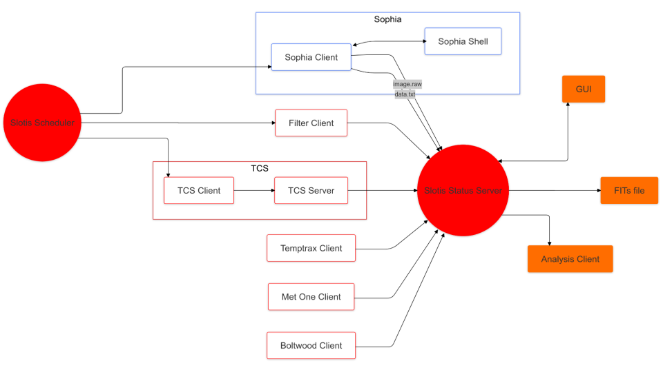

# superlotis_camera_control
Sophia camera control for Superlotis

This repository conatains code to control the superlotis NUV-optimized CCD SOPHIA BUV 2048 camera. 

## Description:
This uses client-server architecture. 
It runs on the camera computer (server), and the camera commands can be accessed remotely from the main (client) computer.



### Camera control files
* camera.cpp: all camera control commands
   - camera.h: access camera.cpp variables in server.c
* server.c: defines commands that you can use in another computer, through socket connection
   - server.h: connects server.c, camserver.c, camera.cpp
* camserver.c: runs server.c in loop
* makefile: compiles and runs camera.cpp, server.c, camserver.c
   - generates ./bin/camserver_cit (executable)

### Basic usage
server: open and initialize camera
```bash
cd /opt/PrincetonInstruments/picam/ #cd to folder containing makefile
make #compile server script, generate executable
./bin/camserver_cit #run executable to start server and initialize camera
```

client: send commands to camera computer

```bash
cd /opt/PrincetonInstruments/picam/ && echo [cmd]=[arg]| nc localhost 6972 #setter
cd /opt/PrincetonInstruments/picam/ && echo [cmd]| nc localhost 6972 #getter
cd /opt/PrincetonInstruments/picam/ && echo expose| nc localhost 6972 #expose
````

#### client commands:
```bash
exptime [arg: 0 - 240000 ms] #set/get exposure time
exit 
help
shutter_mode [arg: 1, 2, 3] #set/get shutter mode
analog_gain [arg: 0, 1, 2, 3] #set/get adc analog gain
temp [arg: -80 to 90 Celcius] #check values #set/get camera temperature
burst #take a series of exposures in short succession
expose #take an exposure image
bias #take a bias image
dark #take a dark image
status #get exposure status information (idle, currently exposing, reading out, writing out
genfits #generate fits file from raw
```


## Installation/requirements

### Pre-requisites:
* CentOS 7
* Picam SDK v5.15.11 
* cfitsio 4.4.1
* c++11 (2011 version)
* python 2.7.5
* gcc 4.8.5 (Red Hat 4.8.5-44)

### Setting up computer:
Note: PICam only works on Centos7. Apparently, some people have been able to get it working on other operating systems, but they are not officially supported. 

### Useful applications:
1. Anydesk
2. VScode
   > Version 1.25 (2018) is compatable with CentOS7 linked [here](https://code.visualstudio.com/docs/supporting/faq#_previous-release-versions).
   > Opt out of VScode auto-updates [here](https://code.visualstudio.com/docs/supporting/FAQ#:~:text=You%20can%20install%20a%20previous,a%20specific%20release%20notes%20page)
3. SAOImage DS9

### Picam Installation:
1. Download picam_sdk.run file [linked here](https://cdn.princetoninstruments.com/picam/picam_sdk.run)
2. Make picam_sdk executable, then executed it (command line), discussed [here](https://askubuntu.com/questions/18747/how-do-i-install-run-files)
3. After file runs, configure the firewall to allow all traffic through the ethernet adaptor, discussed [here](https://docs.redhat.com/en/documentation/Red_Hat_Enterprise_Linux/7/html/Security_Guide/sec-Using_Firewalls.html#sec-Getting_started_with_firewalld)

### Installing the code
First, clone this repository to your machine
```bash
git clone https://github.com/Hamden-Lab/superlotis_camera_control.git
cd /opt/PrincetonInstruments/picam/ && make
./bin/camserver_cit
```

